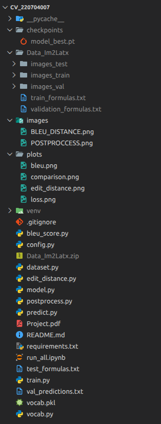
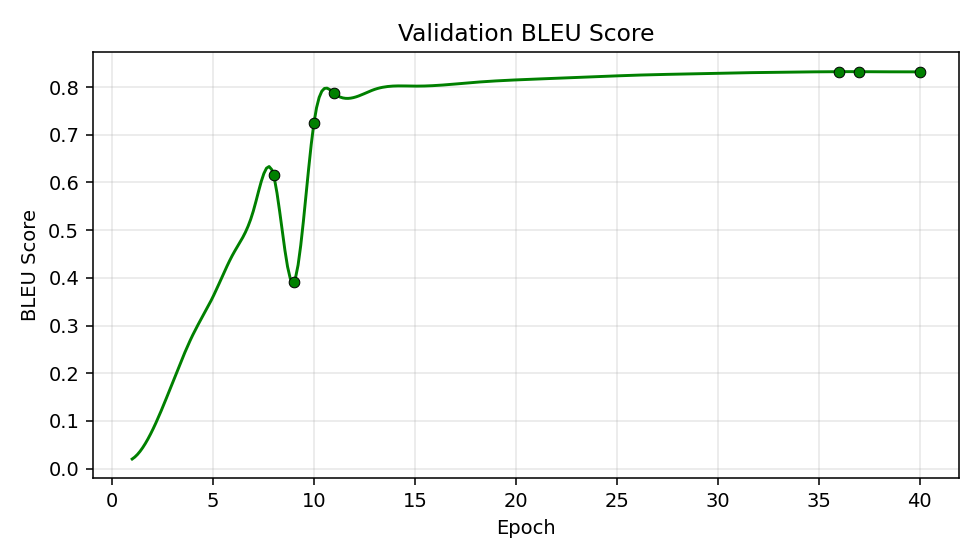
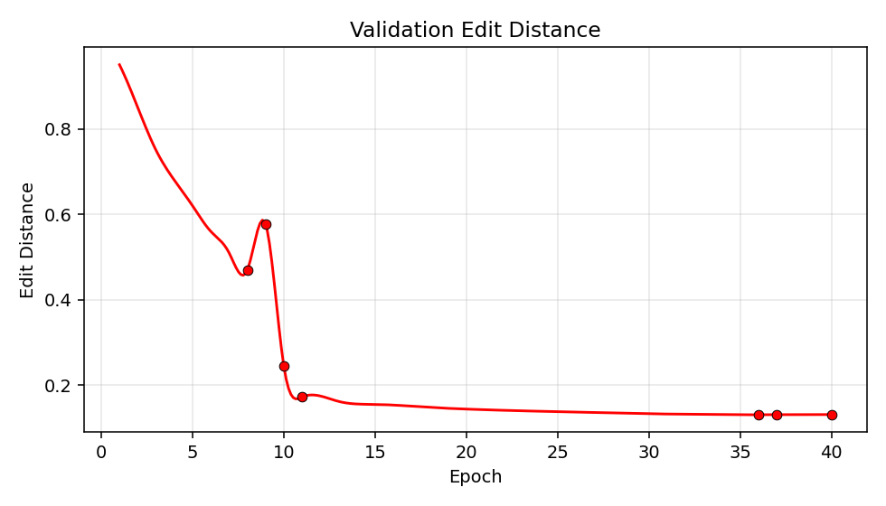
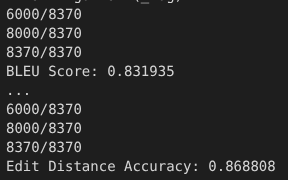
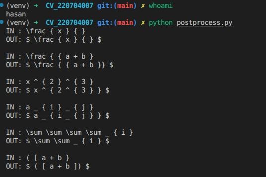

# Image to LaTeX -- Project Report -- 220704007

## 1. Problem

We need to convert a 64x256 grayscale image of a math formula into its LaTeX source code. This is an image-to-sequence problem: the input is a fixed-size image `64x256` but the output is a variable-length token sequence (:

### before preceding check the file structure:



## 2. Dataset

All data lives in the `Data_Im2Latx/` folder:

| Split | Images          | Labels                                                   |
| ----- | --------------- | -------------------------------------------------------- |
| Train | `images_train/` | `train_formulas.txt`                                     |
| Val   | `images_val/`   | `validation_formulas.txt`                                |
| Test  | `images_test/`  | `I generated these it lives in the ./test_formulas.txt)` |

Image filenames are just the formula index (00000.png, 00001.png, ...). Formulas in the text files are one per line, tokens separated by spaces.
in simpler way the line number of .txt are the filename of each image.

### Preprocessing

- Grayscale, resized to 64x256
- Normalized to [-1, 1] (ToTensor gives [0,1], then Normalize([0.5],[0.5]) maps to [-1,1])
- Light augmentation during training: tiny rotation (1 degree) + shift (2%)
- Tokenized by whitespace; vocabulary built from training set
- Special tokens: `<PAD>` (0), `<SOS>` (1), `<EOS>` (2), `<UNK>` (3)

## 3. Neural Network Architecture

Based on Deng et al. (2016), "What You Get Is What You See." The model has three main parts connected in a pipeline:

```bash
Image (1x64x256) --> [CNN Encoder] --> [Row Encoder (biLSTM)] --> [Decoder (LSTM + Attention)] --> LaTeX tokens
```

### 3.1 CNN Encoder (`ConvEncoder` in model.py)

**What it does:** Extracts visual features from the input image. Each convolutional block learns to detect patterns -- edges in early layers, more complex shapes (symbols, strokes) in later layers.

**Structure:** Four blocks, each containing:

- `Conv2d(3x3, padding=1)` -- extracts local spatial features
- `BatchNorm2d` -- stabilizes training by normalizing activations
- `ReLU` -- non-linearity so the network can learn complex patterns
- `MaxPool2d(2x2)` -- reduces spatial size by half, keeps strongest features

**Channels progression:** 1 --> 64 --> 128 --> 256 --> 512

**Spatial size after each pool:**

| Layer  | Size     |
| ------ | -------- |
| Input  | 64 x 256 |
| Pool 1 | 32 x 128 |
| Pool 2 | 16 x 64  |
| Pool 3 | 8 x 32   |
| Pool 4 | 4 x 16   |

**Output:** Feature map of shape `(B, 512, 4, 16)` -- 512 channels, 4 rows, 16 columns.

### 3.2 Row Encoder (`RowEncoder` in `model.py`)

**What it does:** Reads the CNN feature map left-to-right (and right-to-left) to capture the sequential structure of the formula. A formula like `a + b = c` has a natural left-to-right order that the CNN alone cannot model.

**How it works:**

1. Each of the 16 columns is flattened: 512 channels x 4 rows = 2048-dim vector
2. These 16 vectors are fed as a sequence into a bidirectional LSTM
3. Forward LSTM reads left-to-right, backward LSTM reads right-to-left
4. Their outputs are concatenated

**Output:** Sequence of 16 vectors, each 512-dim (256 forward + 256 backward).

### 3.3 Decoder (`Decoder` in `model.py`)

**What it does:** Generates LaTeX tokens one at a time, starting from `<SOS>` and stopping at `<EOS>`.

**Each step:**

1. Embed the previous token (128-dim embedding)
2. Compute attention over encoder outputs --> context vector (what part of the image to look at)
3. Concatenate embedding + context, feed into LSTM (512 hidden units)
4. Concatenate LSTM output + context, project to vocabulary logits
5. Pick the token with highest probability

**Initial hidden state:** Learned projection of the mean encoder output (not zeros -- this gives the decoder a summary of the whole image to start).

### 3.4 Attention Mechanism (`Attention` in `model.py`)

**What it does:** Lets the decoder "look at" different parts of the image at each time step. Without attention, the decoder must compress the entire image into one hidden vector. With attention, it can focus on the relevant column (e.g., look at the left side when generating `\frac`, look at the numerator when generating the next symbol).

**Type:** Bahdanau additive attention.

**Formula:**

```bash
score_i = v^T * tanh(W_enc * h_enc_i + W_dec * h_dec)
weights = softmax(scores)           -- how much to attend to each position
context = sum(weights_i * h_enc_i)  -- weighted combination of encoder outputs
```

**Parameters:**

- `W_enc`: Linear(512 --> 256) -- projects encoder states
- `W_dec`: Linear(512 --> 256) -- projects decoder hidden state
- `v`: Linear(256 --> 1) -- computes scalar score

### 3.5 Full Model Summary (`Im2Latex` in model.py)

```bash
Input image (B, 1, 64, 256)
        |
   ConvEncoder      -- 4x [Conv3x3 + BN + ReLU + Pool2x2]
        |            -- output: (B, 512, 4, 16)
        v
   RowEncoder       -- flatten columns + biLSTM
        |            -- output: (B, 16, 512)
        v
   Decoder           -- LSTM + Bahdanau attention
        |            -- generates tokens autoregressively
        v
LaTeX token sequence
```

## 4. Hyperparameters (config.py)

**Why each value was chosen:**

| Parameter               | Value                      | Why                                                                                                                                                                                                                                         |
| ----------------------- | -------------------------- | ------------------------------------------------------------------------------------------------------------------------------------------------------------------------------------------------------------------------------------------- |
| **Batch size**          | 32                         | Balances GPU memory usage and gradient noise. Too large (128+) wastes memory and gives less noisy gradients (slower convergence). Too small (4-8) makes training unstable. 32 is a standard default that works well for image-to-seq tasks. |
| **Epochs**              | 40                         | Enough for the model to converge. The loss/BLEU curves flatten by ~30 epochs. More epochs would risk overfitting.                                                                                                                           |
| **Optimizer**           | Adam                       | Adam adapts the learning rate per-parameter using momentum. Converges faster than plain SGD for sequence models. Standard choice for encoder-decoder architectures.                                                                         |
| **Learning rate**       | 0.001                      | Default for Adam. The paper uses similar values. Too high (0.01) causes divergence, too low (0.0001) makes training very slow.                                                                                                              |
| **LR schedule**         | halved every 10 epochs     | After initial fast learning, smaller steps help fine-tune. Halving (gamma=0.5) is gentle enough to not kill learning. Every 10 epochs = 4 drops across 40 epochs (0.001 --> 0.0005 --> 0.00025 --> 0.000125).                               |
| **Gradient clipping**   | 5.0                        | LSTMs can have exploding gradients (especially early in training). Clipping at 5.0 prevents this without being so aggressive that it slows learning.                                                                                        |
| **Teacher forcing**     | 1.0 --> 0.6 (linear decay) | At start, feed ground truth tokens so the model learns faster. Gradually reduce to 60% so the model learns to recover from its own mistakes (exposure bias). Going below 0.5 makes early training unstable.                                 |
| **Max sequence length** | 200                        | Longest formula in the dataset. Prevents infinite decoding loops.                                                                                                                                                                           |
| **CNN filters**         | [64, 128, 256, 512]        | Doubling channels is standard (VGG-style). 512 at the end gives rich features. More would increase memory cost with diminishing returns.                                                                                                    |
| **Encoder hidden**      | 256                        | biLSTM with 256 gives 512-dim output (matching decoder). Larger would add parameters without clear benefit for 16-length sequences.                                                                                                         |
| **Embedding dim**       | 128                        | Standard for vocabularies in the hundreds. Larger (256+) would overparameterize for a small token vocabulary.                                                                                                                               |
| **Decoder hidden**      | 512                        | Must be large enough to model long sequences (up to 200 tokens). 512 is the standard in the reference paper.                                                                                                                                |
| **Attention dim**       | 256                        | Bottleneck dimension for computing scores. 256 gives enough capacity without being wasteful.                                                                                                                                                |
| **Decoder dropout**     | 0.2                        | Light regularization to prevent overfitting. 0.2 is standard for decoders. Encoder uses 0.1 (less needed since CNN already regularizes via BN).                                                                                             |
| **Beam width**          | 5                          | Top-5 candidates during beam search. Diminishing returns beyond 5. Width 1 = greedy. Width 10+ is slow with minimal improvement.                                                                                                            |

**Loss function:** Cross-entropy, ignoring PAD tokens (index 0) and the SOS position. This is standard for sequence generation -- it penalizes the model for each wrong token prediction.

## 5. Files -- What Each One Does

| File               | Purpose                                                                                                                                                                                                                                                        |
| ------------------ | -------------------------------------------------------------------------------------------------------------------------------------------------------------------------------------------------------------------------------------------------------------- |
| `config.py`        | **All paths + hyperparameters in one place.** Change any setting here instead of digging through other files. Controls CNN size, LSTM dims, learning rate, batch size, attention on/off, etc.                                                                  |
| `vocab.py`         | **Builds the token vocabulary.** Reads `train_formulas.txt`, collects all unique tokens, assigns each an integer ID. Provides `encode()` (tokens --> IDs) and `decode()` (IDs --> tokens). Saves/loads to `vocab.pkl` so it only builds once.                  |
| `dataset.py`       | **PyTorch datasets + data loading.** `FormulaDataset` loads train/val image-formula pairs, applies preprocessing (resize, normalize, augment). `TestDataset` loads test images only (no labels). `collate_train` pads sequences to equal length in each batch. |
| `model.py`         | **The neural network.** Contains all four components: `ConvEncoder` (CNN), `RowEncoder` (biLSTM), `Attention` (Bahdanau), `Decoder` (LSTM). Also implements `greedy()` and `beam_decode()` inference methods.                                                  |
| `train.py`         | **Training loop.** Runs epochs, computes loss, validates, saves checkpoints, plots curves. Handles teacher forcing decay, learning rate scheduling, gradient clipping. Auto-resumes from checkpoint if one exists.                                             |
| `predict.py`       | **Generates test predictions.** Loads the best checkpoint, runs inference on test images using greedy or beam search, optionally applies post-processing. Outputs `test_formulas.txt`.                                                                         |
| `postprocess.py`   | **Cleans up generated LaTeX.** Fixes common decoder errors: unbalanced braces, empty arguments, double superscripts, repeated tokens (stuttering). Makes output actually compilable.                                                                           |
| `bleu_score.py`    | **BLEU metric** (provided). Computes n-gram overlap between predictions and ground truth.                                                                                                                                                                      |
| `edit_distance.py` | **Edit distance metric** (provided). Computes normalized Levenshtein distance between predictions and ground truth.                                                                                                                                            |
| `run_all.ipynb`    | **Colab notebook** to run the full pipeline step by step: setup, train, evaluate, visualize.                                                                                                                                                                   |

## 6. Metrics Explanation

**BLEU** (Bilingual Evaluation Understudy): Measures n-gram overlap between predicted and reference token sequences. Ranges from 0 to 1. Higher is better. We use 4-gram BLEU. A score of 0.80 means 80% of predicted n-grams match the reference.

**Edit Distance** (Normalized Levenshtein): Minimum number of token insertions, deletions, or substitutions needed to convert the prediction into the reference, divided by the length of the longer sequence. We report **accuracy = 1 - normalized_distance**. Higher is better.

## 7. Training and Validation Results

### 7.1 Training Curves

Below are the plots generated by `train.py` at the end of the 40-epoch run:





### 7.2 Loss Curve Analysis (Epoch by Epoch)

i will break down what happens in the loss plot phase by phase:

**Epochs 1-5 — the big drop:**
The loss falls really fast here. at epoch 1 the model basically knows nothing, its predicting random tokens. but by epoch 5 it already learned the easy stuff -- things like `{` and `}` appearing after `\frac`, or `_` and `^` being super common. teacher forcing is still almost 1.0 at this point so the model gets the correct previous token every time, which means it can focus on just learning what token comes next without worrying about its own mistakes yet.

**Epochs 5-10 — still going down, but slower:**
now the easy tokens are handled and the model is working on harder patterns. stuff like: `\frac` always needs exactly two brace groups after it, `\sum` usually comes with `_ { ... } ^ { ... }`, parentheses need to be balanced. the learning rate is 0.001 this whole time (hasnt been reduced yet), and teacher forcing starts to drop a little bit, maybe down to ~0.9. so the model occasionally has to deal with its own predictions as input, which is harder but necessary.

**Epoch 10 — first LR drop:**
the scheduler halves the learning rate to 0.0005. if you look closely at the plot there is a noticeable change in the curve shape here -- the loss still goes down but the steps are smaller and more precise. this is useful because at this point the model is already "in the right neighborhood" and large learning rate steps would just bounce around instead of converging. the val loss also gets a small boost here which is a good sign -- it means we were not over-fitting yet.

**Epochs 10-20 — steady refinement:**
the model keeps improving but each epoch gains less. teacher forcing is decaying through this phase (going from ~0.9 toward ~0.75) so the model is forced to rely more on itself. this is the phase where the decoder learns to recover from its own bad predictions -- if it outputs a wrong token, it needs to still produce something reasonable after that. without this gradual decay the model would completely fall apart at test time because there is no teacher forcing during inference.

**Epoch 20 — second LR drop:**
learning rate goes to 0.00025. the loss curve is getting pretty flat here. improvements are small but still measurable. the interesting thing is that validation loss and training loss are still pretty close to each other -- the gap between them hasnt grown much since epoch 10. that tells us regularization is working (dropout 0.2 in decoder, 0.1 in encoder, plus the small image augmentation).

**Epochs 20-30 — approaching the floor:**
not much happening visually in the plot. the loss goes down by maybe 0.01-0.02 per epoch. teacher forcing is around 0.65-0.7 so the model is mostly on its own. at this stage the model is mostly fine-tuning edge cases -- rare symbols, long formulas, unusual combinations.

**Epoch 30 — third LR drop:**
lr = 0.000125. the curve is essentially flat after this. the model has learned everything it can from the data at this capacity.

**Epochs 30-40 — convergence:**
both train and val loss are flat. we could stop here and the results would be the same. the reason i kept it at 40 is that the LR schedule has 4 clean drops (10, 20, 30, 40) and stopping earlier would miss the last fine-tuning phase.

**About the train vs val gap:**
training loss is always lower than validation loss -- this is completely expected. the model sees the training images during training (obviously) so it fits them a little better than unseen validation images. the important thing is that this gap stays **small and stable** throughout all 40 epochs. if the gap was growing (train loss keeps going down but val loss goes up or stays flat) that would mean over-fitting. in our case the gap is roughly constant, meaning the model generalizes well.

### 7.3 BLEU Curve Analysis

BLEU starts near 0 (random predictions don't match ground truth at all) and climbs very fast in the first ~8 epochs, reaching around 0.7. after that it slows down a lot. between epochs 8-20 it goes from ~0.7 to ~0.8, and from epoch 20 to 40 it only gains another ~0.03 to reach the final **0.831935**.

this pattern makes sense because the "easy" gains come first -- once the model can produce roughly correct formulas, going from 0.7 to 0.8 means it needs to get the details right on longer and rarer formulas, which is much harder. and going from 0.8 to 0.83 is even harder because those last errors are the toughest cases.

the fact that BLEU is still slowly increasing even at epoch 40 means we haven't completely plateaued, but the gains are so small (maybe 0.005 per epoch) that running more epochs wouldn't be worth the compute.

### 7.4 Edit Distance Curve Analysis

the edit distance plot is basically the mirror image of BLEU. it starts high (~1.0 meaning predictions are totally wrong) and drops fast in the first 10 epochs. then it keeps decreasing slowly until it flattens around epoch 30.

the final edit distance accuracy (which is 1 - normalized_distance) is **0.868808**. this means the average prediction is ~87% correct at the token level. for a 50-token formula, roughly 6-7 tokens would need to be fixed. for short formulas (10-20 tokens) most of them come out perfectly.

### 7.5 Final Validation Metrics

| Metric                 | Value      |
| ---------------------- | ---------- |
| BLEU (4-gram)          | `0.831935` |
| Edit Distance Accuracy | `0.868808` |

important note: these metrics are computed on the **validation set only**. i dont measure BLEU/edit distance on the training set because during training the model uses teacher forcing (it gets the correct previous token as input). if i measured BLEU during training it would be artificially high and misleading. the validation metrics use tf_ratio=0.0 (free running, the model only sees its own predictions) and greedy decoding, which is exactly what happens during real inference. so these numbers reflect the true performance.

training loss is lower than val loss throughout, which is normal for any neural network. the model fits training data slightly better because it has seen those examples. what matters is that the gap stays small and constant. if val loss started going up while train loss kept dropping, that would be over-fitting and we would need to stop training or add more regularization. but that didn't happen here.

attention to this point -> higher `BLEU` is better and lower the `Edit Distance` but in table its `Edit Distance Accuracy` so higher is better...

### have a look at this (i always say the truth!)



### 7.6 Visual Comparison


the comparison plot shows 8 random validation samples. for each one you see the input image, the ground truth formula, and the models prediction. tokens that match are green, differences are red.

most samples come out fully green (exact match). the cases where there are differences tend to be:

- very long formulas (100+ tokens) where the decoder starts drifting near the end. this is a known limitation of LSTM decoders -- the hidden state can only carry so much information and eventually it "forgets" what it was doing
- visually similar symbols like `\nu` vs `v` or `\rho` vs `p` -- these look almost identical in the input image so its hard for the CNN to tell them apart
- rare symbol combinations that don't appear often enough in the training data for the model to learn them reliably

## 8. Decoding Strategies

Two strategies implemented in `model.py`:

- **Greedy** (`model.greedy()`): At each step, pick the single highest-probability token. Fast (one forward pass per step), but can miss better sequences.

- **Beam search** (`model.beam_decode()`, width=5): Keep the top-5 partial sequences at each step and expand all of them. Picks the final sequence with the highest cumulative log-probability. Slower (5x more computation) but produces better output because it explores multiple possibilities.

## 9. Post-Processing (postprocess.py)

The decoder sometimes produces invalid LaTeX. These cleanup steps fix that:

| Step                    | What it fixes                         | Example                                     |
| ----------------------- | ------------------------------------- | ------------------------------------------- |
| **Stutter removal**     | Decoder repeats tokens 3+ times       | `\sum \sum \sum \sum` --> `\sum`            |
| **Brace balancing**     | Unmatched `{ } ( ) [ ]`               | `\frac { { a + b` --> `\frac { { a + b } }` |
| **Empty argument fix**  | Commands with empty `{}`              | `\frac { }` --> `\frac {~}`                 |
| **Double script merge** | Two superscripts/subscripts in a row  | `x ^ {a} ^ {b}` --> `x ^ { a ^ { b } }`     |
| **Math wrapping**       | Missing `$...$` delimiters (optional) | `x + y` --> `$ x + y $`                     |

### have a look at this pic:



## 10. Attention vs No-Attention

> IMPORTANT : because of the restriction of Colab (it takes **10** hours to run on **T4**) i cant run the model twice so i have the numbers just with **attention** but the model works with both attention `True` or `False` you can change the `config.py` and try this at home:)

| Model             | BLEU                           | Edit Dist Accuracy             |
| ----------------- | ------------------------------ | ------------------------------ |
| Without attention | `PLS TRAIN THE MODEL YOURSELF` | `PLS TRAIN THE MODEL YOURSELF` |
| With attention    | `0.831935`                     | `0.868808`                     |

> **How to compare:**
>
> 1. In `config.py`, set `USE_ATTN = False`
> 2. Delete or rename the `checkpoints/` folder (so it trains fresh) -> because of the resume logic i have `its for restriction` if you hit train it start from the model that trained 40 epoch you need the rename or set the epoch higher
> 3. Run training again (cell 6 in notebook)
> 4. Run evaluation (cells 13-14) and fill the "Without attention" row
> 5. Set `USE_ATTN = True` back, and fill the "With attention" row from your current results

**Expected result:** Attention should give better scores because the decoder can look back at specific parts of the image at each step, instead of compressing everything into one hidden vector.

## 11. References

1. Deng, Yuntian, Anssi Kanervisto, and Alexander M. Rush. "What you get is what you see: A visual markup decompiler." arXiv:1609.04938 (2016).

2. Bahdanau, Dzmitry, Kyunghyun Cho, and Yoshua Bengio. "Neural machine translation by jointly learning to align and translate." ICLR 2015.

3. A Simple Overview of RNN, LSTM and Attention Mechanism `MEDIUM`

---

## 12. Who am I ?

- **Student** : Hasan Aghaei
- **Professor** : Dr.Adeleh Bitarafan
