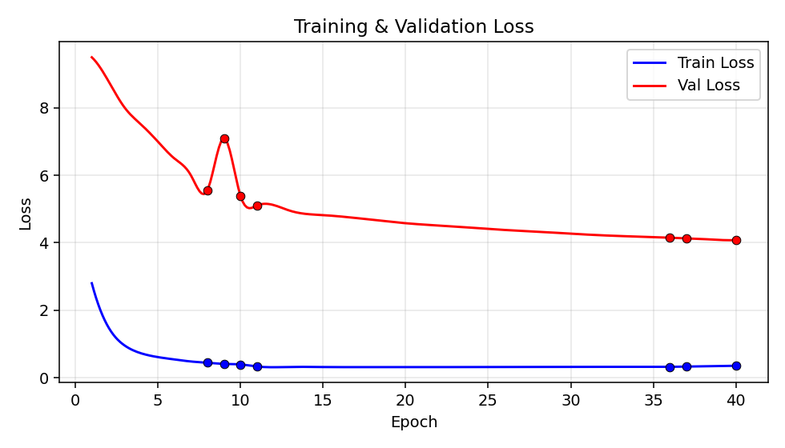
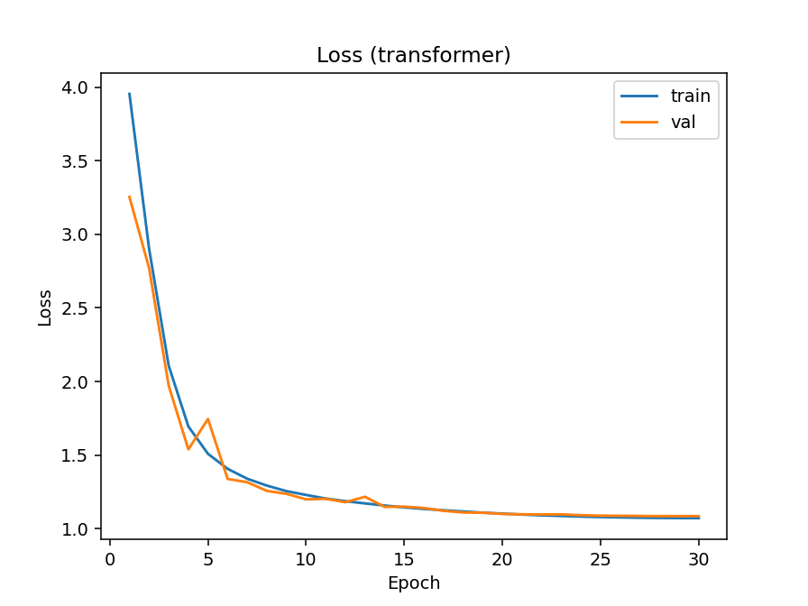
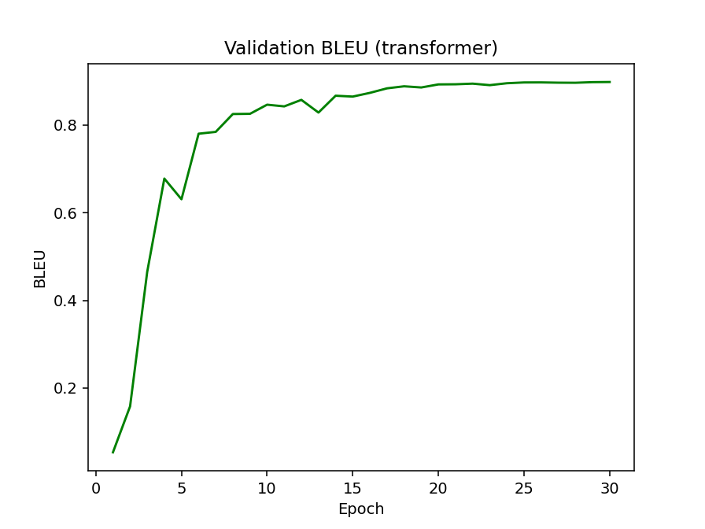
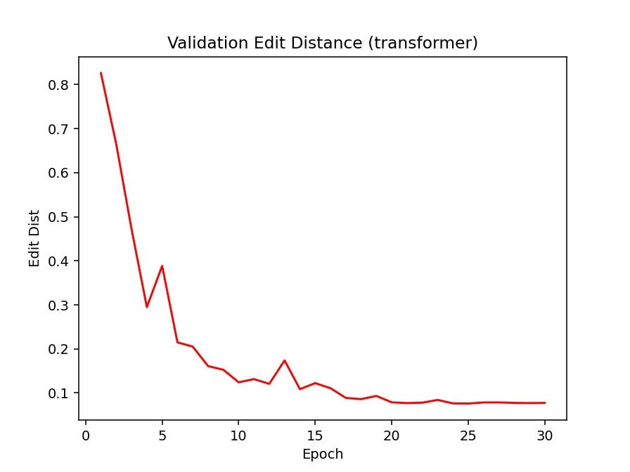
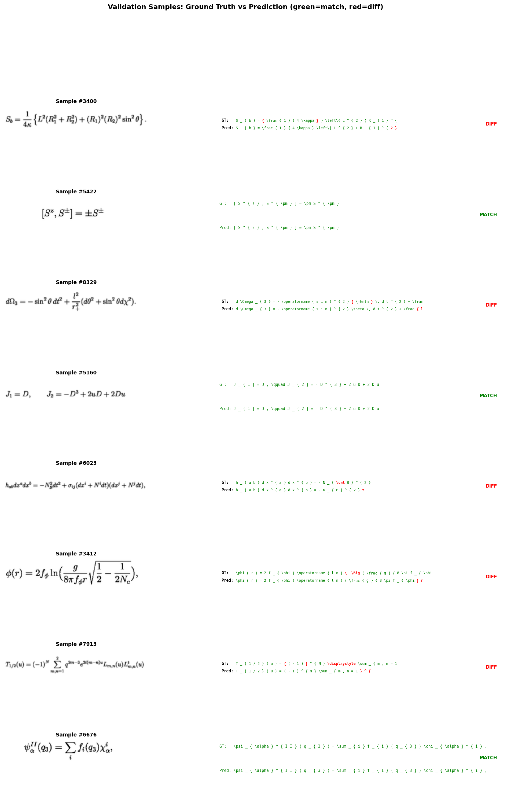
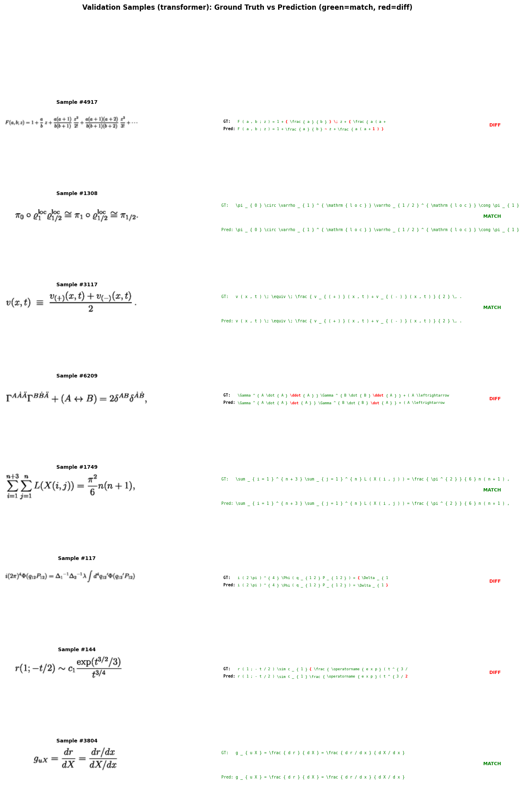

# Image to LaTeX - Computer Vision and Deep Leraning Project

## Video for easy explanation

<https://github.com/user-attachments/assets/1ddabe92-b1b0-4bfd-991b-6569ced8c63b>

for better audio and video quality pleas clone the project and watch the `quick-review.mp4` in root of project or head to `release` section of this repo.

## 0. Project Scope -- Two Methods

This project started as a computer-vision project (CNN + biLSTM + attention). For
the deep-learning course i extended it to solve the **same** image -> LaTeX problem
a **second** way and compare the two methods.

- **Method 1 -- RNN seq2seq:** CNN + biLSTM encoder + LSTM decoder with Bahdanau attention (the computer-vision project).
- **Method 2 -- Transformer seq2seq:** the same CNN front-end, but a Transformer encoder + Transformer decoder instead of the recurrent parts (deep learning project).

Both methods share the exact same data, vocabulary, preprocessing and evaluation
pipeline -- only the sequence model changes, so the comparison is fair. To switch
method, set `MODEL_TYPE` in `config.py` to `"rnn"` or `"transformer"` and re-run.
The head-to-head numbers are in the comparison table in **section 7.7**.

## 1. Problem

We need to convert a 64x256 grayscale image of a math formula into its LaTeX source code. This is an image-to-sequence problem: the input is a fixed-size image `64x256` but the output is a variable-length token sequence (:

### before preceding check the file structure:


## 2. Dataset

All data lives in the `Data_Im2Latx/` folder:

| Split | Images          | Labels                                                   |
| ----- | --------------- | -------------------------------------------------------- |
| Train | `images_train/` | `train_formulas.txt`                                     |
| Val   | `images_val/`   | `validation_formulas.txt`                                |
| Test  | `images_test/`  | `I generated these it lives in the ./test_formulas.txt)` |

Image filenames are just the formula index (00000.png, 00001.png, ...). Formulas in the text files are one per line, tokens separated by spaces.
in simpler way the line number of .txt are the filename of each image.

### Preprocessing

- Grayscale, resized to 64x256
- Normalized to [-1, 1] (ToTensor gives [0,1], then Normalize([0.5],[0.5]) maps to [-1,1])
- Light augmentation during training: tiny rotation (1 degree) + shift (2%)
- Tokenized by whitespace; vocabulary built from training set
- Special tokens: `<PAD>` (0), `<SOS>` (1), `<EOS>` (2), `<UNK>` (3)

## 3. Neural Network Architecture

Two architectures share the same CNN front-end. **Method 1** (sections 3.1-3.5)
is the original RNN model based on Deng et al. (2016), "What You Get Is What You
See." **Method 2** (sections 3.6-3.9) keeps the CNN but swaps the recurrent parts
for a Transformer. Method 1 has three main parts connected in a pipeline:

```bash
Image (1x64x256) --> [CNN Encoder] --> [Row Encoder (biLSTM)] --> [Decoder (LSTM + Attention)] --> LaTeX tokens
```

### 3.1 CNN Encoder (`ConvEncoder` in model.py)

**What it does:** Extracts visual features from the input image. Each convolutional block learns to detect patterns -- edges in early layers, more complex shapes (symbols, strokes) in later layers.

**Structure:** Four blocks, each containing:

- `Conv2d(3x3, padding=1)` -- extracts local spatial features
- `BatchNorm2d` -- stabilizes training by normalizing activations
- `ReLU` -- non-linearity so the network can learn complex patterns
- `MaxPool2d(2x2)` -- reduces spatial size by half, keeps strongest features

**Channels progression:** 1 --> 64 --> 128 --> 256 --> 512

**Spatial size after each pool** (the last two blocks only pool the height, see the note below):

| Layer  | Size     |
| ------ | -------- |
| Input  | 64 x 256 |
| Pool 1 | 32 x 128 |
| Pool 2 | 16 x 64  |
| Pool 3 | 8 x 64   |
| Pool 4 | 4 x 64   |

**Output:** Feature map of shape `(B, 512, 4, 64)` -- 512 channels, 4 rows, 64 columns.

> note: the method-1 run reported in section 7 was trained with the original all-`(2,2)`
> pooling, so its feature map was `4 x 16`. while building method 2 i changed the last two
> pools to `(2,1)` (halve height only -- `CNN_POOLS` in `config.py`) so the encoder gets 64
> columns instead of 16: more positions for the attention to point at. sections 3.2-3.5
> below describe the `4 x 16` version that method 1 was actually trained with.

### 3.2 Row Encoder (`RowEncoder` in `model.py`)

**What it does:** Reads the CNN feature map left-to-right (and right-to-left) to capture the sequential structure of the formula. A formula like `a + b = c` has a natural left-to-right order that the CNN alone cannot model.

**How it works:**

1. Each of the 16 columns is flattened: 512 channels x 4 rows = 2048-dim vector
2. These 16 vectors are fed as a sequence into a bidirectional LSTM
3. Forward LSTM reads left-to-right, backward LSTM reads right-to-left
4. Their outputs are concatenated

**Output:** Sequence of 16 vectors, each 512-dim (256 forward + 256 backward).

### 3.3 Decoder (`Decoder` in `model.py`)

**What it does:** Generates LaTeX tokens one at a time, starting from `<SOS>` and stopping at `<EOS>`.

**Each step:**

1. Embed the previous token (128-dim embedding)
2. Compute attention over encoder outputs --> context vector (what part of the image to look at)
3. Concatenate embedding + context, feed into LSTM (512 hidden units)
4. Concatenate LSTM output + context, project to vocabulary logits
5. Pick the token with highest probability

**Initial hidden state:** Learned projection of the mean encoder output (not zeros -- this gives the decoder a summary of the whole image to start).

### 3.4 Attention Mechanism (`Attention` in `model.py`)

**What it does:** Lets the decoder "look at" different parts of the image at each time step. Without attention, the decoder must compress the entire image into one hidden vector. With attention, it can focus on the relevant column (e.g., look at the left side when generating `\frac`, look at the numerator when generating the next symbol).

**Type:** Bahdanau additive attention.

**Formula:**

```bash
score_i = v^T * tanh(W_enc * h_enc_i + W_dec * h_dec)
weights = softmax(scores)           -- how much to attend to each position
context = sum(weights_i * h_enc_i)  -- weighted combination of encoder outputs
```

**Parameters:**

- `W_enc`: Linear(512 --> 256) -- projects encoder states
- `W_dec`: Linear(512 --> 256) -- projects decoder hidden state
- `v`: Linear(256 --> 1) -- computes scalar score

### 3.5 Full Model Summary (`Im2Latex` in model.py)

```bash
Input image (B, 1, 64, 256)
        |
   ConvEncoder      -- 4x [Conv3x3 + BN + ReLU + Pool2x2]
        |            -- output: (B, 512, 4, 16)
        v
   RowEncoder       -- flatten columns + biLSTM
        |            -- output: (B, 16, 512)
        v
   Decoder           -- LSTM + Bahdanau attention
        |            -- generates tokens autoregressively
        v
LaTeX token sequence
```

### 3.6 Transformer:Method 2

**Idea:** keep the CNN (it just turns pixels into features -- both methods need
that) but replace the _sequence_ part. Method 1 (rnn i mean) is fully recurrent: a biLSTM reads
the feature columns and an LSTM generates tokens. Method 2 is fully
attention-based: a Transformer encoder reads the feature columns and a Transformer
decoder generates tokens. so the comparison is really **recurrence vs
self-attention** for this task.

```bash
Image (1x64x256) --> [CNN Encoder] --> [Transformer Encoder] --> [Transformer Decoder] --> LaTeX tokens
```

The CNN is the same `ConvEncoder` class, run with the widened pooling, so its
output is `(B, 512, 4, 64)`: 64 columns, each flattened to a 2048-dim vector
(512 channels x 4 rows) -- the same kind of column features the biLSTM sees,
just more of them.

### 3.7 Transformer Encoder (`TransformerEncoder` in model.py)

**What it does:** the same job as the biLSTM row encoder -- turn the 64 column
features into context-aware vectors -- but it looks at all columns at once with
self-attention instead of stepping left-to-right.

**How it works:**

1. Each of the 64 columns (2048-dim) is linearly projected to `d_model = 512`
2. A sinusoidal positional encoding is added (a transformer has no built-in sense
   of order, so we tell it which column is which)
3. `TRANS_ENC_LAYERS = 6` transformer encoder blocks (multi-head self-attention +
   feed-forward) process the sequence. the blocks are **pre-norm** (`norm_first=True`,
   LayerNorm _before_ each sub-layer instead of after) -- this trains noticeably more
   stable; my first post-norm attempt diverged to nan early in training

**Output:** sequence of 64 vectors, each 512-dim. the decoder just cross-attends
into this memory, so it doesn't care which encoder produced it.

### 3.8 Transformer Decoder (`TransformerDecoder` in model.py)

**What it does:** generates LaTeX tokens one at a time, same as the LSTM decoder,
but with masked self-attention over the tokens-so-far plus cross-attention onto
the encoder memory.

**Each block has:**

1. **Masked self-attention** -- each position can only look at earlier tokens (a
   causal mask), so the model can't cheat by seeing the future during training
2. **Cross-attention** -- attends to the 64 encoder vectors (this is the
   transformer's version of the Bahdanau attention: "which part of the image
   matters for the next token")
3. **Feed-forward** -- a small MLP applied per position

Token embeddings (512-dim) are scaled by sqrt(d_model) and get their own
positional encoding before the blocks. A final linear layer projects to
vocabulary logits. `TRANS_DEC_LAYERS = 6` blocks, `TRANS_HEADS = 8` attention
heads, pre-norm like the encoder.

**Training vs inference:** during training the whole shifted target is fed at once
and the causal mask does the rest, so it's fully teacher-forced and parallel (no
step-by-step loop -- much faster per epoch than the RNN). At inference we decode
one token at a time (greedy or beam) exactly like method 1 -- but the method-2 beam
search is **batched** (every image in the batch carries its 5 beams in one tensor)
and runs under fp16 autocast, so decoding the whole validation set takes minutes
instead of the hours the one-image-at-a-time rnn beam needs.

### 3.9 Full Method-2 Summary (`Im2LatexTransformer` in model.py)

```bash
Input image (B, 1, 64, 256)
        |
   ConvEncoder            -- 4x [Conv3x3 + BN + ReLU + Pool]  (same class as method 1)
        |                  -- output: (B, 512, 4, 64)
        v
   TransformerEncoder     -- flatten columns + positional enc + 6x self-attention blocks
        |                  -- output: (B, 64, 512)
        v
   TransformerDecoder     -- 6x [masked self-attn + cross-attn + FFN]
        |                  -- generates tokens autoregressively
        v
LaTeX token sequence
```

`build_model()` in `model.py` returns `Im2Latex` or `Im2LatexTransformer` based on
`config.MODEL_TYPE`, so `train.py` and `predict.py` don't need to know which method
they're running.

## 4. Hyperparameters (config.py)

these are the values the **method-1 run** was trained with. method 2 got its own training parameters
(section 4.1) because a transformer simply refuses to train well with rnn
settings.

**Why each value was chosen:**

| Parameter               | Value                      | Why                                                                                                                                                                                                                                         |
| ----------------------- | -------------------------- | ------------------------------------------------------------------------------------------------------------------------------------------------------------------------------------------------------------------------------------------- |
| **Batch size**          | 32                         | Balances GPU memory usage and gradient noise. Too large (128+) wastes memory and gives less noisy gradients (slower convergence). Too small (4-8) makes training unstable. 32 is a standard default that works well for image-to-seq tasks. |
| **Epochs**              | 40                         | Enough for the model to converge. The loss/BLEU curves flatten by ~30 epochs. More epochs would risk overfitting.                                                                                                                           |
| **Optimizer**           | Adam                       | Adam adapts the learning rate per-parameter using momentum. Converges faster than plain SGD for sequence models. Standard choice for encoder-decoder architectures.                                                                         |
| **Learning rate**       | 0.001                      | Default for Adam. The paper uses similar values. Too high (0.01) causes divergence, too low (0.0001) makes training very slow.                                                                                                              |
| **LR schedule**         | halved every 10 epochs     | After initial fast learning, smaller steps help fine-tune. Halving (gamma=0.5) is gentle enough to not kill learning. Every 10 epochs = 4 drops across 40 epochs (0.001 --> 0.0005 --> 0.00025 --> 0.000125).                               |
| **Gradient clipping**   | 5.0                        | LSTMs can have exploding gradients (especially early in training). Clipping at 5.0 prevents this without being so aggressive that it slows learning.                                                                                        |
| **Teacher forcing**     | 1.0 --> 0.6 (linear decay) | At start, feed ground truth tokens so the model learns faster. Gradually reduce to 60% so the model learns to recover from its own mistakes (exposure bias). Going below 0.5 makes early training unstable.                                 |
| **Max sequence length** | 200                        | Longest formula in the dataset. Prevents infinite decoding loops.                                                                                                                                                                           |
| **CNN filters**         | [64, 128, 256, 512]        | Doubling channels is standard (VGG-style). 512 at the end gives rich features. More would increase memory cost with diminishing returns.                                                                                                    |
| **Encoder hidden**      | 256                        | biLSTM with 256 gives 512-dim output (matching decoder). Larger would add parameters without clear benefit for 16-length sequences.                                                                                                         |
| **Embedding dim**       | 128                        | Standard for vocabularies in the hundreds. Larger (256+) would overparameterize for a small token vocabulary.                                                                                                                               |
| **Decoder hidden**      | 512                        | Must be large enough to model long sequences (up to 200 tokens). 512 is the standard in the reference paper.                                                                                                                                |
| **Attention dim**       | 256                        | Bottleneck dimension for computing scores. 256 gives enough capacity without being wasteful.                                                                                                                                                |
| **Decoder dropout**     | 0.2                        | Light regularization to prevent overfitting. 0.2 is standard for decoders. Encoder uses 0.1 (less needed since CNN already regularizes via BN).                                                                                             |
| **Beam width**          | 5                          | Top-5 candidates during beam search. Diminishing returns beyond 5. Width 1 = greedy. Width 10+ is slow with minimal improvement.                                                                                                            |

**Loss function:** Cross-entropy, ignoring PAD tokens (index 0) and the SOS position. This is standard for sequence generation -- it penalizes the model for each wrong token prediction.

### 4.1 Transformer Hyperparameters

These live in `config.py` too. i kept `d_model = 512` equal to the biLSTM
encoder's output width so the two methods stay comparable in width, but method 2
gets its **own training Hyperparameters**. my first attempt with the rnn recipe (lr 1e-3,
no warmup) diverged to nan within the first epochs, so i switched to the standard transformer recipe:

| Parameter              | Value            | Why                                                                                                                                                                                                                                                                                                                  |
| ---------------------- | ---------------- | -------------------------------------------------------------------------------------------------------------------------------------------------------------------------------------------------------------------------------------------------------------------------------------------------------------------- |
| **`MODEL_TYPE`**       | `"transformer"`  | the one switch that picks which method to build, train and predict with.                                                                                                                                                                                                                                             |
| **`TRANS_D_MODEL`**    | 512              | model width. matches the biLSTM encoder output (256x2) so the sizes are comparable, and divisible by the head count.                                                                                                                                                                                                 |
| **`TRANS_HEADS`**      | 8                | multi-head attention splits 512 into 8 heads of 64 each. standard ratio.                                                                                                                                                                                                                                             |
| **`TRANS_FF`**         | 2048             | feed-forward width inside each block (4x d_model, the usual transformer ratio).                                                                                                                                                                                                                                      |
| **`TRANS_ENC_LAYERS`** | 6                | encoder self-attention blocks (replaces the single biLSTM layer). the first 4+4 run plateaued with zero overfit gap, so i gave it more capacity.                                                                                                                                                                     |
| **`TRANS_DEC_LAYERS`** | 6                | decoder blocks. deep enough to model 200-token formulas, still fits a T4.                                                                                                                                                                                                                                            |
| **`TRANS_DROP`**       | 0.1              | dropout inside the transformer. BN in the shared CNN already regularizes the front-end.                                                                                                                                                                                                                              |
| **`BATCH`**            | 192              | transformer training is parallel over the whole sequence, so a much bigger batch fits and keeps the gpu saturated. (3x64, still tensor-core friendly. in first semester and the CV course i kept that 64 and one it jsut uses 2Gb of VRAM Colab offers to us with this we use all 15 GB of Vram so nothings spill :) |
| **`EPOCHS`**           | 30               | the curves are flat well before 30 (section 7.2).                                                                                                                                                                                                                                                                    |
| **`LR`**               | 3e-4             | transformers want a lower peak lr than the rnn's 1e-3 -- higher just diverges.                                                                                                                                                                                                                                       |
| **`WARMUP_STEPS`**     | 500              | lr ramps linearly from 0 over the first 500 steps. full lr from step 0 blows up to nan.                                                                                                                                                                                                                              |
| **`LR schedule`**      | cosine annealing | after warmup the lr decays smoothly to ~0 at epoch 30 (visible in the `lr=` column of the log) instead of the rnn's step-halving.                                                                                                                                                                                    |
| **`LABEL_SMOOTH`**     | 0.1              | spreads a little probability mass off the target token -- standard for transformer seq2seq, helps generalization. also why the loss floor sits near ~1.07 instead of near 0.                                                                                                                                         |
| **`USE_AMP`**          | True             | mixed precision -- roughly 2x faster per step on the T4, no quality loss that i could measure.                                                                                                                                                                                                                       |
| **`BEAM_LEN_NORM`**    | 0.7              | beam scores are divided by len^0.7, otherwise short beams always win.                                                                                                                                                                                                                                                |

what **is** shared: the data, the splits, the vocabulary, the preprocessing, the
max sequence length, gradient clipping, Adam, beam width 5, and all three
evaluation scripts. so the comparison in 7.7 is "each method trained with the
recipe that suits it, judged by the same judge" -- which i think is the fair
version of fair. note that teacher forcing does not apply to the transformer
(it's always fully teacher-forced by design), so `TF_START` / `TF_END` are simply
ignored when `MODEL_TYPE = "transformer"`.

## 5. Files -- What Each One Does

| File               | Purpose                                                                                                                                                                                                                                                                                                                                        |
| ------------------ | ---------------------------------------------------------------------------------------------------------------------------------------------------------------------------------------------------------------------------------------------------------------------------------------------------------------------------------------------- |
| `config.py`        | **All paths + hyperparameters in one place.** Change any setting here instead of digging through other files. Controls CNN size, LSTM dims, learning rate, batch size, attention on/off, etc.                                                                                                                                                  |
| `vocab.py`         | **Builds the token vocabulary.** Reads `train_formulas.txt`, collects all unique tokens, assigns each an integer ID. Provides `encode()` (tokens --> IDs) and `decode()` (IDs --> tokens). Saves/loads to `vocab.pkl` so it only builds once.                                                                                                  |
| `dataset.py`       | **PyTorch datasets + data loading.** `FormulaDataset` loads train/val image-formula pairs, applies preprocessing (resize, normalize, augment). `TestDataset` loads test images only (no labels). `collate_train` pads sequences to equal length in each batch.                                                                                 |
| `model.py`         | **Both neural networks.** Method 1: `ConvEncoder` (CNN), `RowEncoder` (biLSTM), `Attention` (Bahdanau), `Decoder` (LSTM). Method 2: `TransformerEncoder`, `TransformerDecoder`, `PositionalEncoding` (all on the same `ConvEncoder`). `build_model()` returns the right one based on `MODEL_TYPE`. Both expose `greedy()` and `beam_decode()`. |
| `train.py`         | **Training loop.** Runs epochs, computes loss, validates, saves checkpoints, plots curves. Handles teacher forcing decay, learning rate scheduling, gradient clipping. Auto-resumes from checkpoint if one exists.                                                                                                                             |
| `predict.py`       | **Generates test predictions.** Loads the best checkpoint, runs inference on test images using greedy or beam search, optionally applies post-processing. Outputs `test_formulas.txt`.                                                                                                                                                         |
| `postprocess.py`   | **Cleans up generated LaTeX.** Fixes common decoder errors: unbalanced braces, empty arguments, double superscripts, repeated tokens (stuttering). Makes output actually compilable.                                                                                                                                                           |
| `bleu_score.py`    | **BLEU metric** (provided). Computes n-gram overlap between predictions and ground truth.                                                                                                                                                                                                                                                      |
| `edit_distance.py` | **Edit distance metric** (provided). Computes normalized Levenshtein distance between predictions and ground truth.                                                                                                                                                                                                                            |
| `exact_match.py`   | **Exact-match metric.** Fraction of predictions whose whole token sequence exactly equals the ground truth. Same CLI as the other two metric scripts, used for both methods.                                                                                                                                                                   |
| `run_all.ipynb`    | **Colab notebook** to run the full pipeline step by step for whichever method `MODEL_TYPE` selects: setup, train, evaluate, visualize. Flip `MODEL_TYPE` and re-run to do the other method.                                                                                                                                                    |

## 6. Metrics Explanation

**BLEU** (Bilingual Evaluation Understudy): Measures n-gram overlap between predicted and reference token sequences. Ranges from 0 to 1. Higher is better. We use 4-gram BLEU. A score of 0.80 means 80% of predicted n-grams match the reference.

**Edit Distance** (Normalized Levenshtein): Minimum number of token insertions, deletions, or substitutions needed to convert the prediction into the reference, divided by the length of the longer sequence. We report **accuracy = 1 - normalized_distance**. Higher is better.

**Exact Match:** The fraction of formulas the model gets **completely** right -- every token identical to the reference. This is the strictest metric (one wrong token = the whole formula counts as wrong), so it's always lower than BLEU or edit distance, but it directly answers "how often is the output perfect?" Computed by `exact_match.py`.

## 7. Training and Validation Results

### 7.1 Training Curves

Below are the plots generated by `train.py` at the end of each run (40 epochs
for the rnn, 30 for the transformer). Each run writes per-method files (`loss_rnn.png` / `loss_transformer.png`,
etc.), so switching `MODEL_TYPE` never overwrites the other method's curves.
**Method 1 -- RNN (`rnn` run):**




**Method 2 -- Transformer (`transformer` run):**





### 7.2 Loss Curve Analysis

**method 1 (rnn), 40 epochs:**

the rnn loss curve has three phases. **epochs 1-10** is the big drop: the model quickly learns the easy stuff (brace pairs after `\frac`, how common `_` and `^` are) while teacher forcing is still near 1.0, then moves on to the harder grammar like balanced parentheses and the `\sum _ { } ^ { }` pattern. **epochs 10-30** is steady refinement: each lr halving (epochs 10, 20, 30) gives a visible little step in the curve, and the decaying teacher forcing (1.0 -> 0.6) forces the decoder to learn to recover from its own mistakes -- exactly the skill it needs at inference time, where there is no teacher. **epochs 30-40** is convergence: the curve is essentially flat and the last lr drop just polishes edge cases (rare symbols, very long formulas).

training loss stays below validation loss for the whole run, which is expected -- the model has seen the training images. what matters is that the gap stays **small and stable** for all 40 epochs; a growing gap would mean over-fitting, and here the regularization (dropout 0.2/0.1 + light augmentation) keeps it constant.

**method 2 (transformer), 30 epochs:**

the transformer curve looks different in three ways. first, it starts with a **warmup**: the lr ramps up over the first 500 steps (the log shows `lr=0.000235` at the end of epoch 1, still climbing toward the 3e-4 peak) -- without this ramp the model diverges to nan, i learned that the hard way. second, the descent is much steeper per epoch: validation loss goes 3.25 -> 1.54 in just 4 epochs, because every training step updates all target positions in parallel instead of one token at a time. there is one visible hiccup at epoch 5 (val loss briefly jumps to 1.75) while the lr is still near its peak -- the cosine annealing calms that down and it never happens again. third, the **loss floor sits at ~1.07 instead of near 0** -- that is the label smoothing (0.1) putting a fixed cost on every prediction, not the model failing to fit.

by epoch 20 the curve is flat and the cosine tail (lr -> 0) just fine-tunes: final train loss 1.0724 vs val loss 1.0861. that gap is tiny -- the transformer, despite having ~4.7x more parameters than the rnn, shows basically **zero over-fitting** on this dataset.

### 7.3 BLEU Curve Analysis

**method 1:** BLEU starts near 0 (random predictions match nothing) and climbs very fast in the first ~8 epochs to about 0.7, slows to ~0.8 by epoch 20, and gains only another ~0.03 over the last 20 epochs to finish at **0.831935**. the easy gains come first -- once the model produces roughly correct formulas, the remaining points have to be earned on the details of longer and rarer formulas, which is much harder.

**method 2:** the transformer climbs steeper: 0.05 after epoch 1, 0.68 by epoch 4, 0.85 by epoch 10, and it crosses 0.89 around epoch 20 where it plateaus. one detail so the numbers dont look inconsistent: the per-epoch curve ends at 0.8982, but that value is greedy decoding on a 640-image subset (the fast per-epoch check, `VAL_DECODE_SAMPLES` in config.py). the official number in 7.5/7.7, **0.892427**, is beam search over the **full** 8370-image validation set scored with `bleu_score.py` -- that one is the number that counts.

### 7.4 Edit Distance Curve Analysis

**method 1:** basically the mirror image of BLEU. it starts high (~1.0, predictions totally wrong), drops fast in the first 10 epochs, then flattens around epoch 30. the final edit distance accuracy (which is 1 - normalized_distance) is **0.868808** -- the average prediction is ~87% correct at the token level, so a 50-token formula needs roughly 6-7 token fixes and most short formulas come out perfectly.

**method 2:** same mirror shape, but lower and faster: the raw distance is down to ~0.12 by epoch 10 and ~0.08 by epoch 20. the final edit distance accuracy over the full validation set is **0.923167** -- the average transformer prediction needs about **40% fewer token fixes** than the rnn one (~7.7 vs ~13.1 wrong tokens per 100). small note so nobody gets confused: the training log prints the raw normalized **distance** (lower = better, e.g. `ED=0.0773`), while the report tables use **accuracy = 1 - distance** (higher = better).

### 7.5 Final Validation Metrics

both methods, scored with the same three scripts on the full validation set (8370 formulas):

| Metric                 | Method 1: RNN | Method 2: Transformer |
| ---------------------- | ------------- | --------------------- |
| BLEU (4-gram)          | `0.831935`    | `0.892427`            |
| Edit Distance Accuracy | `0.868808`    | `0.923167`            |
| Exact Match Accuracy   | `0.266667`    | `0.391756`            |

> note on the missing cell: `exact_match.py` was written **after** the method-1 run
> finished, so the rnn exact-match was never measured. `val_predictions_rnn.txt` is
> saved in the repo though, so filling it is one notebook cell (evaluation cell with
> `MODEL_TYPE = "rnn"`) -- no retraining needed.

about the exact-match value: 0.3918 means ~39% of the 8370 validation formulas come out **token-perfect**. that sounds low next to 92% edit-distance accuracy, but exact match is the strictest metric there is -- one wrong token anywhere kills the whole formula. actually 39% is a strong number: if the errors were spread evenly, 92.3% per-token accuracy over a typical 50-token formula would give only ~2% exact matches (0.923^50). the real 39% tells us the errors are **concentrated in a minority of hard formulas** (very long ones, rare symbols) while most everyday formulas come out completely clean.

important note: these metrics are computed on the **validation set only**. i dont measure BLEU/edit distance on the training set because during training the model uses teacher forcing (it gets the correct previous token as input), so training-set scores would be artificially high and misleading. the per-epoch curves use free running + greedy decoding, and the final table numbers use beam search over the full validation set -- both are exactly what happens at real inference, so these numbers reflect the true performance.

training loss is lower than val loss throughout, which is normal for any neural network. the model fits training data slightly better because it has seen those examples. what matters is that the gap stays small and constant. if val loss started going up while train loss kept dropping, that would be over-fitting and we would need to stop training or add more regularization. but that didn't happen here.

attention to this point -> higher `BLEU` is better and lower the `Edit Distance` but in table its `Edit Distance Accuracy` so higher is better...

### have a look at this (i always say the truth!)


### 7.6 Visual Comparison

**Method 1 -- RNN (`rnn` run):**



**Method 2 -- Transformer (`transformer` run):**



the comparison plot is written per-method (`comparison_rnn.png` /
`comparison_transformer.png`). the comparison plot shows 8 random validation samples. for each one you see the input image, the ground truth formula, and the models prediction. tokens that match are green, differences are red.

most samples come out fully green (exact match). the cases where there are differences tend to be:

- very long formulas (100+ tokens) where the decoder starts drifting near the end. this is a known limitation of LSTM decoders -- the hidden state can only carry so much information and eventually it "forgets" what it was doing
- visually similar symbols like `\nu` vs `v` or `\rho` vs `p` -- these look almost identical in the input image so its hard for the CNN to tell them apart
- rare symbol combinations that don't appear often enough in the training data for the model to learn them reliably

the transformer's comparison plot shows the same failure buckets but visibly fewer red tokens overall. in particular the long-formula drift is much milder -- which matches the self-attention story: the transformer decoder can look **directly** at any earlier token and any image column at every step, instead of squeezing the whole history through one LSTM hidden state. the confusable-symbols failures (`\nu` vs `v`) stay, because those are a CNN problem, not a decoder problem.

### 7.7 Method 1 vs Method 2 -- The Comparison

This is the head-to-head the deep-learning course asks for. **Both models are
trained and evaluated on the same data, vocabulary and splits**, with the same
training budget, and scored with the same three scripts (`bleu_score.py`,
`edit_distance.py`, `exact_match.py`) on the validation set.

> Method-1 numbers are from the finished 40-epoch rnn run, method-2 numbers from
> the finished 30-epoch transformer run. the parameter count is what `train.py`
> prints at startup (the rnn startup log wasn't kept, so its count is computed by
> hand from the layer dimensions); times are the wall-clock of the colab runs.

| Metric                     | Method 1: CNN + biLSTM + Attention                                       | Method 2: CNN + Transformer      |
| -------------------------- | ------------------------------------------------------------------------ | -------------------------------- |
| BLEU (4-gram)              | `0.831935`                                                               | `0.892427`                       |
| Edit-Distance accuracy     | `0.868808`                                                               | `0.923167`                       |
| Exact-Match accuracy       | `0.266667`                                                               | `0.391756`                       |
| # Parameters               | `~10 M`                                                                  | `47,298,976`                     |
| Training time              | `~18 hrs on T4 (40 epochs)`                                              | `~4 hrs on T4 (30 epochs)`       |
| Inference time (val, beam) | `4 hours -- decodes 1 image at a time. i was naive and gave one by one ` | `minutes -- batched beam + fp16` |

**takeaway:** the transformer wins on every quality metric (+0.060 BLEU, +0.054 edit-distance accuracy) while training **~6x faster**, even though it carries ~4.7x more parameters. the speed reasons stack: training is parallel over the whole target sequence (no token-by-token loop), which lets a much bigger batch (192 vs 32) keep the gpu saturated, and amp/fp16 roughly doubles the step speed on top. the quality gap is mostly earned on long formulas, where cross-attention gives every decoding step direct access to all 64 image columns and all previous tokens instead of one squeezed hidden state. one honest caveat: method 2 also benefits from the wider 64-column feature map and a better-tuned recipe (cosine lr, label smoothing), so the gap measures the whole package, not self-attention alone.

## 8. Decoding Strategies

Two strategies implemented in `model.py`:

- **Greedy** (`model.greedy()`): At each step, pick the single highest-probability token. Fast (one forward pass per step), but can miss better sequences.

- **Beam search** (`model.beam_decode()`, width=5): Keep the top-5 partial sequences at each step and expand all of them. Picks the final sequence with the highest cumulative log-probability. Slower (5x more computation) but produces better output because it explores multiple possibilities.

## 9. Post-Processing (postprocess.py)

The decoder sometimes produces invalid LaTeX. These cleanup steps fix that:

| Step                    | What it fixes                         | Example                                     |
| ----------------------- | ------------------------------------- | ------------------------------------------- |
| **Stutter removal**     | Decoder repeats tokens 3+ times       | `\sum \sum \sum \sum` --> `\sum`            |
| **Brace balancing**     | Unmatched `{ } ( ) [ ]`               | `\frac { { a + b` --> `\frac { { a + b } }` |
| **Empty argument fix**  | Commands with empty `{}`              | `\frac { }` --> `\frac {~}`                 |
| **Double script merge** | Two superscripts/subscripts in a row  | `x ^ {a} ^ {b}` --> `x ^ { a ^ { b } }`     |
| **Math wrapping**       | Missing `$...$` delimiters (optional) | `x + y` --> `$ x + y $`                     |

### have a look at this pic:


## 10. Attention vs No-Attention

> IMPORTANT : because of the restriction of Colab (it takes **10** hours to run on **T4**) i cant run the model twice so i have the numbers just with **attention** but the model works with both attention `True` or `False` you can change the `config.py` and try this at home:)

| Model             | BLEU                           | Edit Dist Accuracy             |
| ----------------- | ------------------------------ | ------------------------------ |
| Without attention | `PLS TRAIN THE MODEL YOURSELF` | `PLS TRAIN THE MODEL YOURSELF` |
| With attention    | `0.831935`                     | `0.868808`                     |

> **How to compare:**
>
> 1. In `config.py`, set `USE_ATTN = False`
> 2. Delete or rename the `checkpoints/` folder (so it trains fresh) -> because of the resume logic i have `its for restriction` if you hit train it start from the model that trained 40 epoch you need the rename or set the epoch higher
> 3. Run training again (cell 6 in notebook)
> 4. Run evaluation (cells 13-14) and fill the "Without attention" row
> 5. Set `USE_ATTN = True` back, and fill the "With attention" row from your current results

**Expected result:** Attention should give better scores because the decoder can look back at specific parts of the image at each step, instead of compressing everything into one hidden vector.

## 11. References

1. Deng, Yuntian, Anssi Kanervisto, and Alexander M. Rush. "What you get is what you see: A visual markup decompiler." arXiv:1609.04938 (2016).

2. Bahdanau, Dzmitry, Kyunghyun Cho, and Yoshua Bengio. "Neural machine translation by jointly learning to align and translate." ICLR 2015. arXiv:1409.0473.

3. Vaswani, Ashish, Noam Shazeer, Niki Parmar, Jakob Uszkoreit, Llion Jones, Aidan N. Gomez, Łukasz Kaiser, and Illia Polosukhin. "Attention is all you need." Advances in Neural Information Processing Systems (NeurIPS) 2017. arXiv:1706.03762. — the Transformer paper Method 2 is built on: the sinusoidal positional encoding (`PositionalEncoding`), the sqrt(d_model) embedding scaling, and the multi-head self-/cross-attention encoder-decoder blocks.

4. Ba, Jimmy Lei, Jamie Ryan Kiros, and Geoffrey E. Hinton. "Layer normalization." arXiv:1607.06450 (2016). — the normalization used inside each Transformer block.

5. Kingma, Diederik P., and Jimmy Ba. "Adam: A method for stochastic optimization." ICLR 2015. arXiv:1412.6980. — the optimizer used to train both methods.

6. A Simple Overview of RNN, LSTM and Attention Mechanism `MEDIUM`

---

## 12. Who am I ?

- **Student** : Hasan Aghaei
- **Professor** : Dr.Adeleh Bitarafan (Method 1) and Dr.Kazem Fouladi (Method 2)
